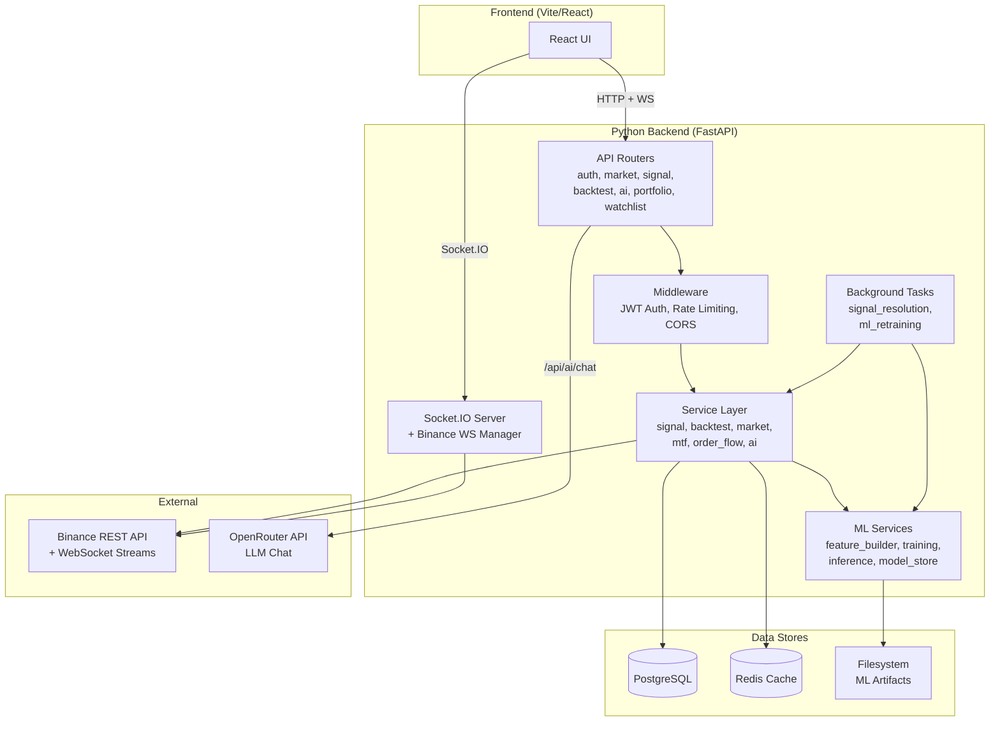
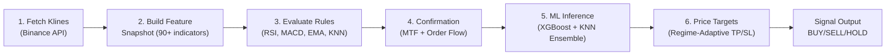
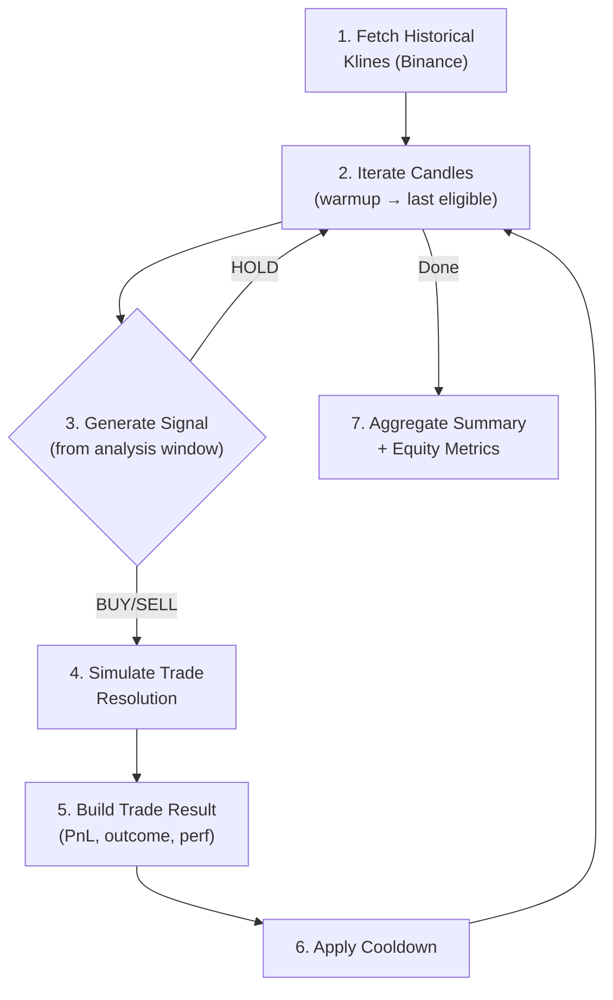

# Analis-AI — Python Backend: Complete Technical Documentation

> **Framework**: FastAPI 0.115 · **Database**: PostgreSQL (async SQLAlchemy) · **Cache**: Redis · **ML**: XGBoost + Lorentzian KNN · **Real-time**: Socket.IO + Binance WebSocket

---

## Table of Contents

- [1. Architecture Overview](#1-architecture-overview)
- [2. Directory Structure & File Map](#2-directory-structure--file-map)
- [3. Feature Summary Table](#3-feature-summary-table)
- [4. Core Infrastructure](#4-core-infrastructure)
- [5. Authentication Feature](#5-authentication-feature)
- [6. Market Data Feature](#6-market-data-feature)
- [7. 🔥 Signal Generation Engine (Deep Dive)](#7--signal-generation-engine-deep-dive)
- [8. 🔥 Backtesting Engine (Deep Dive)](#8--backtesting-engine-deep-dive)
- [9. 🔥 AI/ML Model Pipeline (Deep Dive)](#9--aiml-model-pipeline-deep-dive)
- [10. AI Chat Feature](#10-ai-chat-feature)
- [11. Portfolio Management Feature](#11-portfolio-management-feature)
- [12. Watchlist Feature](#12-watchlist-feature)
- [13. Real-Time WebSocket Streaming](#13-real-time-websocket-streaming)
- [14. Background Scheduler Tasks](#14-background-scheduler-tasks)
- [15. Technology Stack & Dependencies](#15-technology-stack--dependencies)

---

## 1. Architecture Overview

The Python backend is a **complete port** of the original Node.js/Express backend, rebuilt with FastAPI for better async performance, native ML integration, and type safety. The key architectural change is that **ML inference and training run in-process** — eliminating the HTTP microservice boundary that existed in the Node.js version.



---

## 2. Directory Structure & File Map

```
backend_py/
├── .env                          # Environment variables (DB, Redis, JWT, API keys)
├── .gitignore
├── alembic/                      # Database migration scripts (Alembic)
├── alembic.ini                   # Alembic configuration
├── pyproject.toml                # Python project metadata
├── requirements.txt              # Pinned dependencies (51 packages)
├── scripts/                      # Utility scripts (.gitkeep placeholder)
├── tests/                        # Test suite
│   ├── __init__.py
│   ├── test_auth.py              # Authentication tests
│   └── test_signal_engine.py     # Signal rule evaluation tests
├── venv/                         # Python virtual environment
└── app/                          # Main application package
    ├── __init__.py
    ├── main.py                   # FastAPI app entry point, lifespan, Socket.IO
    ├── config.py                 # Centralized settings (pydantic-settings)
    ├── database.py               # Async SQLAlchemy engine + session factory
    ├── cache.py                  # Redis client (with DummyRedis fallback)
    ├── middleware/
    │   └── auth.py               # JWT Bearer token authentication
    ├── models/                   # SQLAlchemy ORM models
    │   ├── user.py               # User table
    │   ├── signal.py             # Signal table (BUY/SELL/HOLD with outcomes)
    │   ├── backtest_run.py       # BacktestRun table (JSONB for config/trades)
    │   ├── portfolio.py          # Portfolio + Holding tables
    │   └── watchlist.py          # Watchlist + WatchlistAsset tables
    ├── schemas/                  # Pydantic request/response schemas
    │   ├── auth.py               # Login, Register, Token schemas
    │   ├── signal.py             # Signal generate/resolve/list schemas
    │   ├── backtest.py           # Backtest request/response schemas
    │   ├── market.py             # Market overview schema
    │   ├── portfolio.py          # Portfolio/holding schemas
    │   ├── watchlist.py          # Watchlist schemas
    │   └── ai.py                 # AI chat request/response schemas
    ├── routes/                   # API endpoint definitions
    │   ├── auth.py               # POST /api/auth/register, login, GET profile
    │   ├── market.py             # GET /api/market/price, klines, overview, symbols
    │   ├── signal.py             # POST /api/signals/generate, GET/PUT/DELETE signals
    │   ├── backtest.py           # POST /api/backtest, GET history, DELETE
    │   ├── ai.py                 # POST /api/ai/chat, GET ml/lifecycle, ml/health
    │   ├── portfolio.py          # GET/POST/DELETE /api/portfolio
    │   └── watchlist.py          # GET/POST/DELETE /api/watchlist
    ├── services/                 # Business logic layer
    │   ├── signal_service.py     # Signal generation engine (rule + ML)
    │   ├── backtest_service.py   # Backtest simulation engine
    │   ├── market_service.py     # Binance REST API client (price, klines)
    │   ├── mtf_service.py        # Multi-Timeframe bias analysis
    │   ├── order_flow_service.py # Order flow (funding rate, OI, L/S ratio)
    │   ├── ml_feature_service.py # Feature snapshot wrapper
    │   ├── ml_inference_service.py # ML prediction (XGBoost + KNN ensemble)
    │   ├── indicator_service.py  # Standalone RSI/MACD calculators
    │   ├── ai_service.py         # OpenRouter LLM chat integration
    │   ├── news_service.py       # News feed (placeholder)
    │   └── binance_ws.py         # Binance WebSocket stream manager
    ├── ml/                       # Machine Learning pipeline
    │   ├── feature_builder.py    # 1078-line feature engineering (90+ indicators)
    │   ├── feature_schema.py     # 115-column feature schema definition
    │   ├── training.py           # XGBoost + Lorentzian KNN training pipeline
    │   ├── lorentzian_model.py   # Custom Lorentzian distance KNN classifier
    │   ├── model_store.py        # Model registry + artifact persistence
    │   ├── dataset_service.py    # Training data export from DB
    │   └── artifacts/            # Trained model files (.joblib), registry.json
    ├── tasks/                    # Background scheduled jobs
    │   ├── signal_resolution.py  # Auto-resolve pending signals (every 5 min)
    │   └── ml_retraining.py      # Auto-retrain ML models (every 24 hours)
    └── utils/
        └── helpers.py            # Shared math/format/direction utilities
```

---

## 3. Feature Summary Table

| # | Feature | API Prefix | Route File | Service File(s) | Model(s) | Description |
|---|---------|-----------|------------|-----------------|----------|-------------|
| 1 | **Authentication** | `/api/auth` | `routes/auth.py` | (inline) | `models/user.py` | Register, login, JWT token, profile |
| 2 | **Market Data** | `/api/market` | `routes/market.py` | `services/market_service.py` | — | Live prices, OHLCV klines, market overview |
| 3 | **Signal Engine** | `/api/signals` | `routes/signal.py` | `services/signal_service.py`, `mtf_service.py`, `order_flow_service.py`, `ml_feature_service.py`, `ml_inference_service.py` | `models/signal.py` | Multi-layered signal generation with ML |
| 4 | **Backtesting** | `/api/backtest` | `routes/backtest.py` | `services/backtest_service.py` | `models/backtest_run.py` | Historical trade simulation engine |
| 5 | **AI/ML Pipeline** | `/api/ai/ml/*` | `routes/ai.py` | `ml/training.py`, `ml/feature_builder.py`, `ml/model_store.py`, `ml/lorentzian_model.py`, `ml/dataset_service.py` | (filesystem) | XGBoost + Lorentzian KNN ensemble |
| 6 | **AI Chat** | `/api/ai/chat` | `routes/ai.py` | `services/ai_service.py` | — | LLM-powered trading assistant |
| 7 | **Portfolio** | `/api/portfolio` | `routes/portfolio.py` | (inline) | `models/portfolio.py` | Holdings tracker (symbol, qty, buy price) |
| 8 | **Watchlist** | `/api/watchlist` | `routes/watchlist.py` | (inline) | `models/watchlist.py` | Symbol watchlist with live ticker enrichment |
| 9 | **Real-Time WS** | Socket.IO events | `main.py` | `services/binance_ws.py` | — | Live price streaming via Binance WebSocket |

---

## 4. Core Infrastructure

### 4.1 Application Entry Point — `main.py`

The `main.py` file is the central nervous system of the backend. It:

1. **Creates the FastAPI app** with metadata (title, version, description)
2. **Configures CORS** middleware for frontend origins (`localhost:5173`)
3. **Sets up rate limiting** via `slowapi` (200 requests/minute per IP)
4. **Manages the application lifespan** (startup → shutdown):
   - Creates database tables via SQLAlchemy
   - Connects to Redis (gracefully degrades to `DummyRedis` if unavailable)
   - Starts the APScheduler with two recurring jobs:
     - Signal resolution (every 5 minutes)
     - ML model retraining (every 24 hours)
5. **Mounts Socket.IO** on the same ASGI server for WebSocket support
6. **Registers all 7 API routers** under `/api/*`
7. **Handles Socket.IO events**: `subscribe-ticker`, `unsubscribe-ticker`, `subscribe-watchlist`, `unsubscribe-watchlist`

### 4.2 Configuration — `config.py`

Uses `pydantic-settings` to load all configuration from `.env` with typed defaults. Key configuration groups:

| Group | Settings | Purpose |
|-------|----------|---------|
| **Server** | `port`, `frontend_url` | Server binding and CORS |
| **Database** | `database_url` | PostgreSQL connection string |
| **Redis** | `redis_url` | Cache connection |
| **Auth** | `jwt_secret`, `jwt_algorithm`, `jwt_expire_minutes` | JWT token configuration |
| **ML Weights** | `ml_rule_confidence_weight` (0.35), `ml_probability_weight` (0.65) | How much ML vs rules influence the final signal |
| **ML Thresholds** | `min_ml_probability` (0.6), `min_model_roc_auc` (0.58) | Quality gates for ML predictions |
| **ML Promotion** | `ml_promotion_min_dataset_rows` (250), `ml_promotion_min_roc_auc` (0.58) | Auto-promotion eligibility thresholds |
| **Kernel Regression** | `kernel_lookback` (8), `kernel_relative_weight` (8.0), `kernel_start_bar` (25) | Lorentzian Classification kernel parameters |
| **Signal Engine** | `default_fees_per_trade_pct` (0.04), `max_concurrent_signals` (5) | Trading defaults |

### 4.3 Database — `database.py`

- **Engine**: Async SQLAlchemy with `asyncpg` driver, pool size 10, max overflow 20
- **Session Factory**: `async_sessionmaker` with `expire_on_commit=False`
- **Dependency**: `get_db()` yields sessions with auto-commit/rollback

### 4.4 Cache — `cache.py`

- Global `redis_client` set during startup
- Falls back to `DummyRedis` (all ops return `None`) if Redis is unavailable
- Used for price caching (10s TTL), market overview (60s), funding rates (300s)

### 4.5 Auth Middleware — `middleware/auth.py`

- OAuth2 Bearer token scheme
- Decodes JWT with `PyJWT`, extracts `user_id`
- Queries database for the `User` model
- Injected as a FastAPI dependency on all protected routes

### 4.6 Utility Helpers — `utils/helpers.py`

Shared math and conversion functions (229 lines) used across services:
- `to_safe_number()`, `to_fixed_number()`, `clamp()`, `to_bounded_int()`
- `get_expected_direction()`, `get_actual_direction()`, `get_outcome_from_directions()`
- `TIMEFRAME_TO_MS` mapping, `DEFAULT_RESOLUTION_CANDLES` per timeframe

---

## 5. Authentication Feature

### Files

| Layer | File | Purpose |
|-------|------|---------|
| Route | `routes/auth.py` | Register, login, profile endpoints |
| Model | `models/user.py` | User ORM model |
| Schema | `schemas/auth.py` | Request/response validation |
| Middleware | `middleware/auth.py` | JWT decode + user lookup |

### Endpoints

| Method | Path | Auth | Description |
|--------|------|------|-------------|
| `POST` | `/api/auth/register` | ❌ | Create account → return JWT |
| `POST` | `/api/auth/login` | ❌ | Verify credentials → return JWT |
| `GET` | `/api/auth/profile` | ✅ | Return current user profile |

### How It Works

1. **Registration**: Hashes password with `bcrypt`, creates `User` row, returns JWT containing `{id: user_id}`
2. **Login**: Finds user by email, verifies bcrypt hash, returns JWT
3. **All protected routes** use `Depends(get_current_user)` which decodes the JWT, queries the user, and injects the `User` model

---

## 6. Market Data Feature

### Files

| Layer | File | Purpose |
|-------|------|---------|
| Route | `routes/market.py` | Price, klines, overview endpoints |
| Service | `services/market_service.py` | Binance REST API client |

### Endpoints

| Method | Path | Description |
|--------|------|-------------|
| `GET` | `/api/market/price/{symbol}` | Current price (cached 10s) |
| `GET` | `/api/market/klines` | OHLCV candlestick data (symbol, interval, limit) |
| `GET` | `/api/market/overview` | Top 100 USDT pairs by volume (cached 60s) |
| `GET` | `/api/market/symbols` | Static list of supported symbols |

### How It Works

- All data comes from **Binance REST API** (`https://api.binance.com/api/v3`)
- Uses `httpx.AsyncClient` for non-blocking HTTP calls
- **Caching**: Price queries cached in Redis for 10 seconds; market overview cached for 60 seconds
- Kline data is normalized to `{openTime, open, high, low, close, volume, closeTime}` format

---

## 7. 🔥 Signal Generation Engine (Deep Dive)

The Signal Engine is the **core intelligence** of the platform. It generates BUY/SELL/HOLD signals by combining multiple analysis layers.

### Files

| Layer | File | Lines | Purpose |
|-------|------|-------|---------|
| Route | `routes/signal.py` | 215 | CRUD endpoints + stats |
| Service | `services/signal_service.py` | 331 | **Core signal generation engine** |
| Service | `services/mtf_service.py` | 134 | Multi-Timeframe confirmation |
| Service | `services/order_flow_service.py` | 168 | Order flow analysis (funding, OI, L/S) |
| Service | `services/ml_feature_service.py` | 34 | Feature snapshot wrapper |
| Service | `services/ml_inference_service.py` | 89 | ML prediction (XGBoost + KNN) |
| ML | `ml/feature_builder.py` | 1078 | Feature engineering (90+ indicators) |
| Model | `models/signal.py` | 68 | Signal database model |
| Schema | `schemas/signal.py` | 67 | Request/response schemas |
| Task | `tasks/signal_resolution.py` | 97 | Auto-resolution background job |
| Test | `tests/test_signal_engine.py` | 102 | Unit tests for rule evaluation |

### Endpoints

| Method | Path | Description |
|--------|------|-------------|
| `POST` | `/api/signals/generate` | Generate a new signal for symbol/timeframe |
| `GET` | `/api/signals` | List user's signals (paginated, filterable by status) |
| `GET` | `/api/signals/stats/summary` | Win/loss stats for completed signals |
| `GET` | `/api/signals/stats/ml-summary` | ML model performance summary |
| `GET` | `/api/signals/{signal_id}` | Get a specific signal |
| `PUT` | `/api/signals/{signal_id}/status` | Manually resolve a signal |
| `DELETE` | `/api/signals/{signal_id}` | Delete a signal |

### Signal Generation Pipeline (5 Stages)



#### Stage 1: Data Fetching

The `generate_signal()` function in `signal_service.py` (lines 244-330) currently fetches **100 klines** from Binance (line 256: `limit=100`). Requires minimum 26 candles for indicator calculation.

> **⚠️ Potential Bug — 100 vs 210 klines**: The original Node.js backend fetched **210 klines**, matching the backtester's default `analysisWindow=210`. With only 100 candles, long-period indicators like **SMA200** (needs 200 bars), and custom features like **Kernel Regression** (`kernel_start_bar=25` with lookback) may not have sufficient data to compute accurately. Consider increasing to `limit=210` to match the original system and ensure all indicators are properly seeded.

#### Stage 2: Feature Engineering (90+ Indicators)

`build_ml_feature_snapshot()` → `build_feature_snapshot()` in `feature_builder.py` computes a massive feature snapshot organized into 8 categories:

| Category | Feature Count | Key Indicators |
|----------|--------------|-----------------|
| **Momentum** | 19 | RSI14, MACD (line/signal/histogram/crossover), Stochastic K/D, CCI20, ROC10, Williams %R, Awesome Oscillator, Ultimate Oscillator, TRIX15, PPO, WaveTrend1/2 |
| **Trend** | 20 | EMA20/50, SMA20/50/200, ADX14, DMI+/-, HMA20, DEMA20, Parabolic SAR, Linear Regression, Kernel RQ/Gaussian estimates, Kernel crossover signals |
| **Volatility** | 12 | ATR14, Bollinger Band width/% B, NATR14, Donchian position/width, Keltner position, Squeeze detection, Z-score |
| **Volume** | 10 | Volume, Volume SMA20, Relative Volume, MFI14, OBV + slope, CMF20, A/D Line + slope, Elder Force Index |
| **Structure** | 18 | Supply/Demand zones (top/bottom/POI/distance), Fair Value Gaps (bull/bear/distance/size), Active zone bias |
| **Candle** | 6 | Body %, Upper/Lower wick %, Bullish/Bearish strength, isBullish |
| **Context** | 8 | Signal type, timeframe, leverage, market regime, OHLC prices |
| **Lorentzian** | 4 | Distance average K8, neighbor label sum, bullish neighbor %, distance trend |

> **Lorentzian Classification Features**: The feature builder implements the core concepts from "Machine Learning: Lorentzian Classification" by @jdehorty. This includes:
> - **Nadaraya-Watson Kernel Regression** (Rational Quadratic + Gaussian kernels) for smoothed trend estimation
> - **WaveTrend Oscillator** for momentum cycling detection
> - **Lorentzian KNN** using `d = Σ log(1 + |xᵢ − yᵢ|)` distance with 8 nearest neighbors and 4-bar chronological spacing

#### Stage 3: Rule Evaluation

The `evaluate_signal_rules()` function in `signal_service.py` (lines 72-163) applies **4 trading rules** with **regime-adaptive weighting**:

| Rule | Type | Weight | Buy Condition | Sell Condition |
|------|------|--------|---------------|----------------|
| **RSI** | Mean Reversion (MR) | 1.5 × MR weight | RSI < oversold threshold | RSI > overbought threshold |
| **MACD** | Trend Following (TF) | 2.0 × TF weight | Bullish crossover + positive histogram | Bearish crossover + negative histogram |
| **EMA20** | Trend Following (TF) | 1.0 × TF weight | Price above EMA20 | Price below EMA20 |
| **Lorentzian KNN** | Pattern Similarity | 2.0 (unweighted) | Bullish neighbor % ≥ 75% | Bullish neighbor % ≤ 25% |

**Regime-Adaptive Weighting** (`_compute_regime_weights()`):

The engine dynamically adjusts rule weights based on detected market regime:

| Regime | ADX Condition | MR Weight | TF Weight | Effect |
|--------|--------------|-----------|-----------|--------|
| TRENDING | ADX > 40 | 0.0 | 1.0 | Disables mean-reversion rules |
| RANGING | ADX < 15 | 1.0 | 0.0 | Disables trend-following rules |
| TRENDING (normal) | ADX 15-40 | 0.4 | 1.0 | Reduces MR influence |
| RANGING (normal) | ADX 15-40 | 1.0 | 0.4 | Reduces TF influence |

**Timeframe-Specific RSI Thresholds**:

```
1m:  Oversold=25, Overbought=75 (strict — fast noise)
5m:  Oversold=28, Overbought=72
15m: Oversold=30, Overbought=70
1h:  Oversold=30, Overbought=70 (default)
4h:  Oversold=33, Overbought=67
1d:  Oversold=35, Overbought=65 (relaxed — slower trends)
```

**Decision Logic**:
- A signal fires as BUY if `buyScore > sellScore`, gap ≥ 1.0, and confidence ≥ 35%
- A signal fires as SELL if `sellScore > buyScore`, gap ≥ 1.0, and confidence ≥ 35%
- Otherwise: HOLD

#### Stage 4: Multi-Timeframe + Order Flow Confirmation

**MTF Confirmation** (`mtf_service.py`):
- Fetches the **next higher timeframe** (1m→5m, 5m→15m, 15m→1h, 1h→4h, 4h→1d)
- Computes 4 checks: Price vs EMA20, Price vs SMA50, RSI direction, EMA20 slope
- If a BUY signal has bearish MTF bias → **blocked** (forced to HOLD)
- If a SELL signal has bullish MTF bias → **blocked** (forced to HOLD)

**Order Flow Confirmation** (`order_flow_service.py`):
- Fetches **funding rate** from Binance Futures API (contrarian: high funding = bearish)
- Fetches **long/short account ratio** (contrarian: extreme ratio = opposite bias)
- Returns BULLISH/BEARISH/NEUTRAL bias with strength score

#### Stage 5: ML Inference

The `get_ml_prediction()` function in `ml_inference_service.py` loads the active model and predicts:

1. Loads the model bundle (XGBoost + KNN + calibrator + imputer) from filesystem
2. Prepares feature frame from the 115-column feature schema
3. Gets XGBoost probability → gets KNN probability → **weighted ensemble**:
   - `raw_probability = XGB × 0.65 + KNN × 0.35`
4. Applies Platt scaling calibration
5. **ML Gate**: If ML probability < 0.6 → signal is forced to HOLD
6. **Confidence Blending**: `final_confidence = rule_confidence × 0.35 + ml_probability × 100 × 0.65`

#### Stage 6: Regime-Adaptive Price Targets

`_get_regime_adaptive_multipliers()` adjusts TP/SL distances based on market regime:

| Regime | TP Multiplier | SL Multiplier | Effect |
|--------|--------------|---------------|--------|
| TRENDING | ATR × 3.9 | ATR × 1.5 | Wide TP, normal SL |
| TRENDING_VOLATILE | ATR × 4.5 | ATR × 1.95 | Very wide TP, wider SL |
| RANGING | ATR × 1.5 | ATR × 1.05 | Tight TP, tight SL |
| BREAKOUT | ATR × 4.5 | ATR × 1.8 | Very wide TP, wider SL |
| CONSOLIDATING | ATR × 1.2 | ATR × 0.9 | Very tight targets |

- **BUY signal**: `target = entry + ATR × TP_mult`, `stop = entry - ATR × SL_mult`
- **SELL signal**: `target = entry - ATR × TP_mult`, `stop = entry + ATR × SL_mult`

### Signal Data Model

The `Signal` table stores:

| Field | Type | Description |
|-------|------|-------------|
| `symbol` | `String(20)` | Trading pair (e.g., BTCUSDT) |
| `timeframe` | `String(5)` | Candle interval (1m, 5m, 1h, etc.) |
| `signal_type` | `String(10)` | BUY, SELL, or HOLD |
| `status` | `String(20)` | PENDING → COMPLETED / CANCELLED |
| `outcome` | `String(20)` | WIN / LOSS / NEUTRAL / CANCELLED |
| `confidence` | `Float` | 0-100% confidence score |
| `price_entry/target/stop_loss` | `Float` | Price levels |
| `features` | `JSONB` | Full 90+ indicator snapshot |
| `ml` | `JSONB` | ML prediction details |
| `scoring` | `JSONB` | Buy/sell score breakdown |

### Auto-Resolution Background Job

The `signal_resolution.py` task runs **every 5 minutes**:

1. Queries all signals with `status = "PENDING"`
2. For each signal, fetches the latest 10 candles
3. Checks if TP or SL was hit:
   - BUY signal: `high >= target → WIN` or `low <= stop_loss → LOSS`
   - SELL signal: `low <= target → WIN` or `high >= stop_loss → LOSS`
4. Updates `status → COMPLETED`, sets `outcome`, `resolved_at`, `resolution_source = "auto_resolution_job"`

---

## 8. 🔥 Backtesting Engine (Deep Dive)

The Backtesting Engine simulates the Signal Engine over historical data to evaluate strategy performance.

### Files

| Layer | File | Lines | Purpose |
|-------|------|-------|---------|
| Route | `routes/backtest.py` | 85 | Run/history/delete endpoints |
| Service | `services/backtest_service.py` | 538 | **Complete backtest simulation engine** |
| Model | `models/backtest_run.py` | 45 | BacktestRun ORM model |
| Schema | `schemas/backtest.py` | 56 | Request/response schemas |

### Endpoints

| Method | Path | Description |
|--------|------|-------------|
| `POST` | `/api/backtest` | Execute a new backtest |
| `GET` | `/api/backtest/history` | List user's past backtest runs |
| `GET` | `/api/backtest/{run_id}` | Get a specific backtest result |
| `DELETE` | `/api/backtest/history/{run_id}` | Delete a backtest run |

### Backtest Request Parameters

| Parameter | Default | Range | Description |
|-----------|---------|-------|-------------|
| `symbol` | BTCUSDT | — | Trading pair |
| `timeframe` | 1h | 1m/5m/15m/1h/4h/1d | Candle interval |
| `limit` | 1000 | 60-1000 | Number of historical candles (if no date range) |
| `analysisWindow` | 210 | 26-300 | Candles used for indicator calculation |
| `warmupCandles` | 26 | 26-400 | Candles to skip before first signal |
| `resolutionCandles` | 5 | 1-50 | Look-ahead window for TP/SL check |
| `sampleSize` | 50 | 1-100 | Number of recent trades to return |
| `leverage` | 10 | 1-125 | Futures leverage multiplier |
| `tradeAmountUsd` | 10.0 | 1-1M | Position size in USD |
| `cooldownCandles` | 1 | 0-100 | Minimum candles between trades |
| `intrabarPolicy` | conservative | conservative/optimistic | Which exit wins when both TP+SL hit in one candle |
| `feesPerTradePct` | 0.04 | 0-1 | Trading fee percentage |
| `slippagePct` | 0.01 | 0-1 | Slippage estimate percentage |
| `startDate` / `endDate` | null | ISO dates | Custom date range (overrides `limit`) |
| `backtestMlModel` | null | model version or "off" | ML model to use during backtest |

### Backtest Simulation Pipeline



#### Step 1: Data Fetching

- Fetches up to 5000 candles from Binance (when using date range)
- Validates minimum data: `warmup + resolution + 1` candles required

#### Step 2-3: Signal Iteration

The main loop in `run_backtest()` slides through historical candles:

```python
for current_index in range(warmup - 1, last_eligible + 1):
    if current_index < cooldown_until_index:
        continue  # Skip during cooldown

    analysis_candles = klines[start : current + 1]  # Window of analysisWindow candles
    signal = generate_signal_from_klines(analysis_candles)  # Uses backtesting entry point

    if signal["type"] == "HOLD":
        skipped_hold_signals += 1
        continue
```

> **Note**: The backtesting entry point `generate_signal_from_klines()` is a **simplified version** that skips MTF and Order Flow analysis (since those would require historical lookups). It uses only Rules + ML.

#### Step 4: Trade Resolution Simulation

Three resolution modes are checked in order for each future candle:

1. **Gap Exit** (`resolve_gap_exit()`): Checks if the candle's **open** price already triggers TP or SL (gap-up/gap-down scenario)

2. **Intrabar Exit** (`resolve_intrabar_exit()`): Checks if the candle's **high/low** touches TP or SL
   - If **both** TP and SL are hit in the same candle (dual-hit), the `intrabarPolicy` decides:
     - `conservative`: Stop loss wins → LOSS
     - `optimistic`: Take profit wins → WIN

3. **Time Expiry**: If no TP/SL is hit within `resolutionCandles` candles, the trade expires at the last candle's close price

#### Step 5: Trade Result Building

`build_trade_result()` constructs a comprehensive trade record:

| Section | Fields | Description |
|---------|--------|-------------|
| **Identity** | symbol, type, timeframe, leverage | Trade setup |
| **Price** | entry, resolution, target, stopLoss | Price levels |
| **Outcome** | expectedDirection, actualDirection, outcome | WIN/LOSS/NEUTRAL |
| **Performance** | priceChange, marketPriceChangePct, directionalReturnPct, leveragedReturnPct, feeImpactPct, slippageImpactPct, netLeveragedReturnPct | Detailed PnL calculation |
| **Position** | tradeAmountUsd, positionNotionalUsd, pnlUsd | Dollar-denominated results |
| **Simulation** | exitReason, resolutionMode, holdingCandles, targetHit, stopLossHit | Simulation metadata |

**Futures Performance Calculation**:
```
directionalReturnPct = marketPriceChangePct (for BUY) or -marketPriceChangePct (for SELL)
leveragedReturnPct = directionalReturnPct × leverage
feeImpactPct = feesPerTradePct × leverage
netReturnPct = max(leveragedReturnPct - feeImpactPct - slippageImpactPct, -100)
pnlUsd = tradeAmount × (netReturnPct / 100)
```

#### Step 7: Aggregate Summary & Equity Metrics

`build_aggregate_summary()` produces:

| Metric | Description |
|--------|-------------|
| `totalSignals` | Total trades simulated |
| `wins`, `losses`, `neutrals` | Outcome counts |
| `winRate`, `lossRate` | Win/loss percentages |
| `avgReturnPct` | Average net leveraged return |
| `totalPnlUsd`, `avgPnlUsd` | Dollar PnL metrics |
| `bestTradePnlUsd`, `worstTradePnlUsd` | Best/worst single trade |
| `byType` | Breakdown by BUY/SELL |
| `byExitReason` | Breakdown by exit type (take_profit, stop_loss, time_expiry) |

`build_equity_metrics()` calculates portfolio-level metrics:

| Metric | Formula | Description |
|--------|---------|-------------|
| **Total Return %** | `(final_equity - 1) × 100` | Compounded return |
| **Max Drawdown %** | `max((peak - equity) / peak)` | Worst peak-to-trough decline |
| **Profit Factor** | `gross_wins / gross_losses` | Reward-to-risk ratio |
| **Sharpe Ratio** | `mean_return / std_dev` | Risk-adjusted return |
| **Calmar Ratio** | `total_return / max_drawdown` | Return vs drawdown |
| **Win/Loss Ratio** | `avg_win / avg_loss` | Average win size vs loss size |
| **Equity Curve** | Array of `{tradeIndex, cumulativeReturnPct, drawdownPct}` | For charting |

---

## 9. 🔥 AI/ML Model Pipeline (Deep Dive)

The AI/ML pipeline is a complete machine learning system that trains, evaluates, stores, and serves binary classification models for signal quality prediction.

### Files

| Layer | File | Lines | Purpose |
|-------|------|-------|---------|
| **Feature Engineering** | `ml/feature_builder.py` | 1078 | Core indicator computation (90+ features) |
| **Feature Schema** | `ml/feature_schema.py` | 115 | Defines the 115 feature columns used for ML |
| **Training Pipeline** | `ml/training.py` | 424 | XGBoost + Lorentzian KNN ensemble training |
| **Lorentzian Model** | `ml/lorentzian_model.py` | 45 | Custom Lorentzian distance KNN classifier |
| **Model Store** | `ml/model_store.py` | 137 | Registry + joblib persistence |
| **Dataset Export** | `ml/dataset_service.py` | 88 | Export resolved signals → CSV training data |
| **Feature Wrapper** | `services/ml_feature_service.py` | 34 | Service-layer wrapper for feature builder |
| **Inference** | `services/ml_inference_service.py` | 89 | Live prediction serving |
| **Auto-Retraining** | `tasks/ml_retraining.py` | 51 | Background retraining job (every 24h) |

### ML Architecture Overview

```mermaid
flowchart TB
    subgraph "Training Pipeline"
        D1["1. Export Dataset<br/>(resolved signals → CSV)"]
        D2["2. Load + Validate<br/>(min 60 rows, both classes)"]
        D3["3. Chronological Split<br/>(60% train / 20% cal / 20% test)"]
        D4["4. Train XGBoost<br/>(250 trees, depth=5)"]
        D5["5. Train Lorentzian KNN<br/>(8 neighbors, custom metric)"]
        D6["6. Platt Calibration<br/>(Logistic Regression on cal set)"]
        D7["7. Walk-Forward Validation<br/>(2-5 folds, TimeSeriesSplit)"]
        D8["8. Promotion Check<br/>(ROC AUC, Brier, dataset size)"]
        D9["9. Save Bundle<br/>(joblib artifacts + registry)"]
        
        D1 --> D2 --> D3 --> D4 --> D5 --> D6 --> D7 --> D8 --> D9
    end

    subgraph "Inference Pipeline"
        I1["1. Load Active Bundle<br/>(from registry)"]
        I2["2. Prepare Features<br/>(115 columns)"]
        I3["3. XGBoost predict_proba"]
        I4["4. Lorentzian KNN predict_proba"]
        I5["5. Weighted Ensemble<br/>(XGB×0.65 + KNN×0.35)"]
        I6["6. Platt Calibration"]
        I7["7. Return Probability"]
        
        I1 --> I2 --> I3 --> I4 --> I5 --> I6 --> I7
    end
```



### 9.1 Feature Engineering — `feature_builder.py`

This is the **largest file in the codebase** (1078 lines). It transforms raw OHLCV candlestick data into a rich feature snapshot with 90+ indicators.

**Technical Indicator Computation** (using `pandas_ta` library):

| Category | Indicators | Library Functions |
|----------|-----------|-------------------|
| **Core (16)** | RSI14, MACD, Stochastic, Bollinger Bands, ATR14, ADX, CCI20, ROC10, MFI14, OBV, EMA20/50, SMA20/50/200 | `ta.rsi()`, `ta.macd()`, `ta.stoch()`, `ta.bbands()`, etc. |
| **Extended Momentum (5)** | Williams %R, Awesome Oscillator, Ultimate Oscillator, TRIX15, PPO | `ta.willr()`, `ta.ao()`, `ta.uo()`, `ta.trix()`, `ta.ppo()` |
| **Extended Trend (3)** | Hull MA, DEMA, Parabolic SAR | `ta.hma()`, `ta.dema()`, `ta.psar()` |
| **Extended Volatility (2)** | Donchian Channels, Keltner Channels | `ta.donchian()`, `ta.kc()` |
| **Extended Volume (3)** | CMF, Accumulation/Distribution, Elder Force | `ta.cmf()`, `ta.ad()`, `ta.efi()` |
| **Statistics (2)** | Z-Score, Linear Regression | `ta.zscore()`, `ta.linreg()` |

**Custom Implementations** (not from `pandas_ta`):

1. **Nadaraya-Watson Kernel Regression** (lines 361-410):
   - `_rational_quadratic_kernel()`: RQ kernel with configurable lookback, relative weight, start bar
   - `_gaussian_kernel()`: Gaussian kernel variant
   - Used to detect trend direction via kernel crossover signals

2. **WaveTrend Oscillator** (lines 419-428):
   - `_wave_trend()`: EMA-smoothed CI oscillator (WT1) + SMA(WT2)
   - Detects momentum cycling via WT1/WT2 crossovers

3. **Lorentzian KNN** (lines 438-538):
   - `_lorentzian_distance()`: `Σ log(1 + |xᵢ − yᵢ|)` — logarithmic compression reduces outlier influence
   - `_compute_lorentzian_features()`: Builds 5-dimensional feature vector [RSI, CCI, ADX, StochK, ROC] per bar, finds 8 nearest neighbors with 4-bar chronological spacing
   - Returns: `distanceAvgK8`, `neighborLabelSum`, `bullishNeighborPct`, `distanceTrend`

4. **Supply/Demand Zones** (lines 135-218):
   - `_latest_swing_level()`: Finds pivot highs/lows using configurable swing length
   - `_calculate_supply_demand()`: Maps zones with ATR-based buffer and distance percentages

5. **Fair Value Gap (FVG)** Detection (lines 250-352):
   - `_find_active_fvg()`: Detects ICT-style 3-candle price gaps
   - Tracks bullish and bearish FVGs with invalidation checking

6. **Market Regime Classification** (lines 96-104):
   - Combines trend direction + volatility metrics
   - Outputs: TRENDING, TRENDING_VOLATILE, RANGING, RANGING_VOLATILE

### 9.2 Feature Schema — `feature_schema.py`

Defines exactly **115 feature columns** used for ML training and inference:

```
momentum.*      (19 features)
trend.*          (20 features, including kernel regression)
volatility.*     (12 features)
volume.*         (10 features)
structure.*      (18 features)
candle.*         (6 features)
context.*        (8 features)
lorentzian.*     (4 features)
```

### 9.3 Training Pipeline — `training.py`

The `train_model()` function (lines 326-423) orchestrates the full training process:

**Step 1: Data Loading & Validation**
- Loads CSV or JSON datasets
- Sorts chronologically by `resolvedAt`/`createdAt`
- Validates: minimum 60 rows, both WIN/LOSS classes present, ≥10 samples per class

**Step 2: Chronological Split**
- `derive_split_sizes()`: 60% train / 20% calibration / 20% test
- **Never shuffles** — preserves time ordering (critical for financial data)
- Adjusts split sizes for small datasets (minimum 20 rows per split)

**Step 3: XGBoost Training**
- `build_base_model()`: XGBClassifier with:
  - 250 estimators, max depth 5, learning rate 0.05
  - 90% subsample, 90% colsample_bytree
  - `binary:logistic` objective with logloss eval
  - Auto-balanced class weights (`scale_pos_weight = negatives / positives`)
- Missing values handled by `SimpleImputer(strategy="constant", fill_value=0)`

**Step 4: Lorentzian KNN Training**
- `build_lorentzian_knn()` in `lorentzian_model.py`:
  - `KNeighborsClassifier` with custom `lorentzian_metric`
  - 8 neighbors, distance-weighted, brute-force algorithm (required for custom metric)
  - Distance formula: `d(x,y) = Σ log(1 + |xᵢ − yᵢ|)`
  - **Why Lorentzian?** Compresses large differences via log(), making it more robust to Black Swan events and FOMC spikes than Euclidean distance

**Step 5: Platt Calibration**
- `fit_calibrator()`: Logistic Regression fitted on calibration set's raw probabilities
- Converts XGBoost's raw probability into well-calibrated probability
- `apply_calibrator()`: Clips probabilities to `[1e-6, 1-1e-6]` before calibration

**Step 6: Walk-Forward Validation**
- `build_walk_forward_metrics()`: Uses `TimeSeriesSplit` with 2-5 folds
- Each fold: train → calibrate → test (all chronological)
- Computes per-fold: ROC AUC, PR AUC, Log Loss, Brier Score
- Aggregates: mean ± std across folds

**Step 7: Promotion Eligibility**
- `evaluate_promotion_eligibility()` checks 4 thresholds:

| Threshold | Default | Description |
|-----------|---------|-------------|
| `min_dataset_rows` | 250 | Minimum training samples |
| `min_roc_auc` | 0.58 | Holdout ROC AUC floor |
| `min_walkforward_roc_auc` | 0.56 | Walk-forward mean ROC AUC floor |
| `max_brier_score` | 0.25 | Holdout Brier score ceiling |

**Step 8: Artifact Persistence**

The model bundle saved by `model_store.py` contains:

```python
bundle = {
    "model": XGBClassifier,          # Primary model
    "imputer": SimpleImputer,         # Feature imputer
    "calibrator": LogisticRegression, # Platt scaler
    "lorentzian_knn": KNeighborsClassifier,  # Ensemble member
    "ensemble_weights": {"xgboost": 0.65, "lorentzian_knn": 0.35},
}
```

Files stored in `ml/artifacts/`:
- `{version}.joblib` — Model bundle
- `{version}.meta.joblib` — Metadata (metrics, promotion, config)
- `registry.json` — Active model version + model list
- `latest_training.json` — Most recent training result

### 9.4 Dataset Service — `dataset_service.py`

`export_training_dataset()` extracts training data from the database:

1. Queries all signals with `status=COMPLETED` and `outcome ∈ {WIN, LOSS}`
2. Flattens `features` JSONB into flat columns matching `FEATURE_COLUMNS`
3. Adds label: `1` (WIN) or `0` (LOSS)
4. Saves to `ml/data/training-data.csv`

### 9.5 Inference Service — `ml_inference_service.py`

`get_ml_prediction()` serves live predictions:

1. Loads the active model bundle from the registry
2. Prepares a 115-column feature frame from the signal's feature snapshot
3. Runs XGBoost `predict_proba()` → gets probability for class 1
4. Runs Lorentzian KNN `predict_proba()` → gets probability for class 1
5. Computes weighted ensemble: `raw = XGB × 0.65 + KNN × 0.35`
6. Applies Platt calibration: `calibrated = calibrator.predict_proba([[raw]])[0][1]`
7. Returns structured result with both model probabilities and ensemble weights

### 9.6 Auto-Retraining — `ml_retraining.py`

Background job running every 24 hours:

1. **Export**: Calls `export_training_dataset(min_signals=60)` → CSV
2. **Train**: Calls `train_model(dataset_path)` → bundle + metadata
3. **Save**: Calls `save_bundle(bundle, metadata, activate=eligible)`
   - Only activates the model if it passes all promotion thresholds
   - Failing models are still saved for analysis but not made active

---

## 10. AI Chat Feature

### Files

| Layer | File | Purpose |
|-------|------|---------|
| Route | `routes/ai.py` | Chat + ML lifecycle endpoints |
| Service | `services/ai_service.py` | OpenRouter API integration |

### Endpoints

| Method | Path | Description |
|--------|------|-------------|
| `POST` | `/api/ai/chat` | Send messages to AI trading assistant |
| `GET` | `/api/ai/ml/lifecycle` | ML training status (placeholder) |
| `GET` | `/api/ai/ml/health` | ML service health check (placeholder) |

### How It Works

- Uses **OpenRouter API** (`openrouter.ai/api/v1/chat/completions`)
- Default model: `meta-llama/llama-3-8b-instruct:free`
- System prompt: "You are a helpful AI trading assistant"
- Accepts optional `context` and `systemPrompt` overrides
- Returns the LLM's response text
- Gracefully handles missing API key by returning disabled message

---

## 11. Portfolio Management Feature

### Files

| Layer | File | Purpose |
|-------|------|---------|
| Route | `routes/portfolio.py` | CRUD endpoints |
| Model | `models/portfolio.py` | Portfolio + Holding ORM models |

### Endpoints

| Method | Path | Description |
|--------|------|-------------|
| `GET` | `/api/portfolio/` | Get user's portfolio with all holdings |
| `POST` | `/api/portfolio/add` | Add a new holding (symbol, qty, buy_price) |
| `DELETE` | `/api/portfolio/{holding_id}` | Remove a holding |

### Data Model

- **Portfolio**: One-to-one with User, auto-created on first access
- **Holding**: symbol, quantity, buy_price, notes, buy_date
- Uses `selectinload` for eager loading of holdings

---

## 12. Watchlist Feature

### Files

| Layer | File | Purpose |
|-------|------|---------|
| Route | `routes/watchlist.py` | CRUD with live enrichment |
| Model | `models/watchlist.py` | Watchlist + WatchlistAsset models |

### Endpoints

| Method | Path | Description |
|--------|------|-------------|
| `GET` | `/api/watchlist` | Get watchlist with live Binance ticker data |
| `POST` | `/api/watchlist/add` | Add symbol to watchlist |
| `DELETE` | `/api/watchlist/remove/{symbol}` | Remove symbol |
| `DELETE` | `/api/watchlist/{symbol}` | Remove symbol (alias) |

### How It Works

- Auto-creates watchlist on first access
- When returning watchlist, **enriches** each asset with live Binance 24hr ticker data:
  - Price, 24h change %, 24h volume, 24h high/low
- Prevents duplicate symbols
- Uses bulk Binance ticker fetch for efficiency

---

## 13. Real-Time WebSocket Streaming

### Files

| Layer | File | Purpose |
|-------|------|---------|
| App | `main.py` (lines 199-296) | Socket.IO event handlers |
| Service | `services/binance_ws.py` | Binance WebSocket manager |

### Socket.IO Events

| Event | Direction | Description |
|-------|-----------|-------------|
| `connect` | Client → Server | Client connects |
| `disconnect` | Client → Server | Client disconnects |
| `subscribe-ticker` | Client → Server | Subscribe to symbol's live price |
| `unsubscribe-ticker` | Client → Server | Unsubscribe from symbol |
| `subscribe-watchlist` | Client → Server | Subscribe to multiple symbols |
| `unsubscribe-watchlist` | Client → Server | Unsubscribe from multiple symbols |
| `price-update` | Server → Client | Live price broadcast to room |

### How It Works

1. Client emits `subscribe-ticker` with a symbol
2. Server joins client to `ticker-{symbol}` Socket.IO room
3. `BinanceWSManager` subscribes to `{symbol}@ticker` Binance WS stream
4. On receiving data, broadcasts `price-update` to the room with:
   - `symbol`, `price`, `priceChangePercent`, `volume24h`, `high24h`, `low24h`

**Features**:
- Reference counting: tracks how many clients are subscribed to each symbol
- Auto-unsubscribe from Binance WS when no clients remain
- Auto-reconnect with retry delay (5 seconds) on connection errors
- Resubscribes to all active symbols on reconnection

---

## 14. Background Scheduler Tasks

Managed by **APScheduler** (`AsyncIOScheduler`), started during application lifespan:

| Task | File | Interval | Description |
|------|------|----------|-------------|
| **Signal Resolution** | `tasks/signal_resolution.py` | Every 5 min | Auto-resolves PENDING signals by checking TP/SL against live prices |
| **ML Retraining** | `tasks/ml_retraining.py` | Every 24 hours | Exports dataset → trains ensemble → saves if eligible |

---

## 15. Technology Stack & Dependencies

### Core Framework
| Package | Version | Purpose |
|---------|---------|---------|
| `fastapi` | 0.115.12 | Web framework |
| `uvicorn[standard]` | 0.34.3 | ASGI server |
| `python-multipart` | 0.0.20 | Form data parsing |
| `pydantic-settings` | 2.9.1 | Configuration management |

### Database & Cache
| Package | Version | Purpose |
|---------|---------|---------|
| `sqlalchemy[asyncio]` | 2.0.41 | Async ORM |
| `asyncpg` | 0.30.0 | PostgreSQL async driver |
| `alembic` | 1.15.2 | Database migrations |
| `redis` | 5.3.0 | Async Redis client |

### Authentication
| Package | Version | Purpose |
|---------|---------|---------|
| `passlib[bcrypt]` | 1.7.4 | Password hashing |
| `PyJWT` | 2.9.0 | JWT tokens |
| `email-validator` | 2.2.0 | Email validation |

### Machine Learning
| Package | Version | Purpose |
|---------|---------|---------|
| `pandas` | ≥2.0 | Data manipulation |
| `pandas_ta` | ≥0.3.14 | Technical indicators |
| `scikit-learn` | ≥1.3.0 | KNN, Logistic Regression, metrics |
| `xgboost` | ≥2.0.0 | Gradient boosting classifier |
| `joblib` | ≥1.3.0 | Model serialization |
| `numpy` | <2.3.0 | Numerical computation |

### Networking & Real-Time
| Package | Version | Purpose |
|---------|---------|---------|
| `httpx` | 0.28.1 | Async HTTP client |
| `websockets` | 15.0.1 | Binance WS streams |
| `python-socketio` | 5.14.0 | Socket.IO server |
| `slowapi` | 0.1.9 | Rate limiting |
| `apscheduler` | 3.11.0 | Background job scheduling |

### Testing
| Package | Version | Purpose |
|---------|---------|---------|
| `pytest` | 8.4.0 | Test framework |
| `pytest-asyncio` | 0.26.0 | Async test support |
